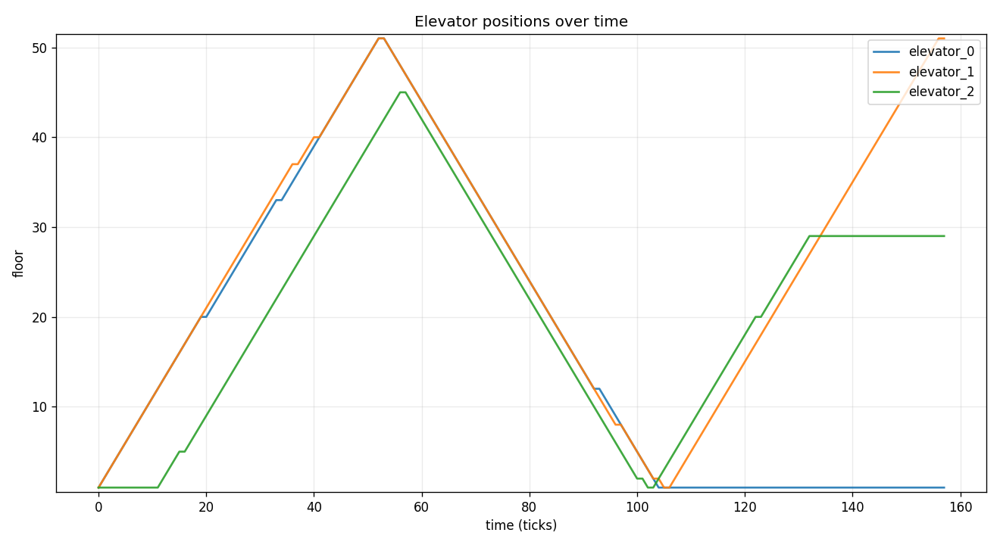
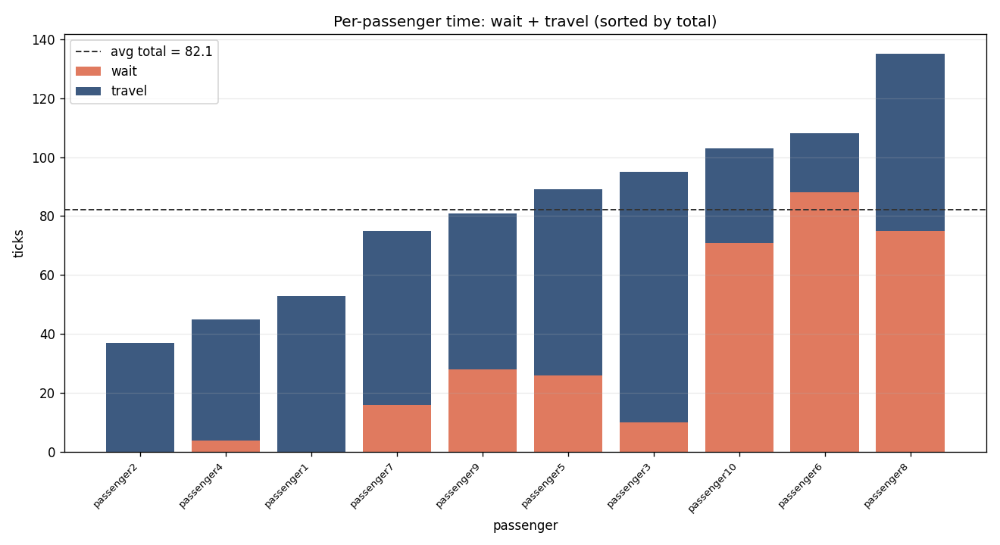
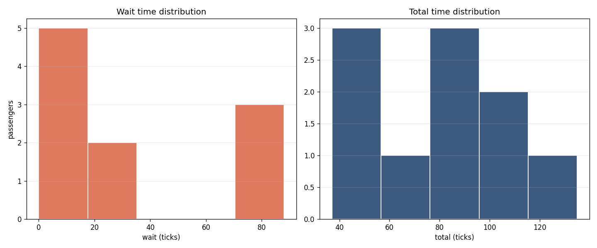
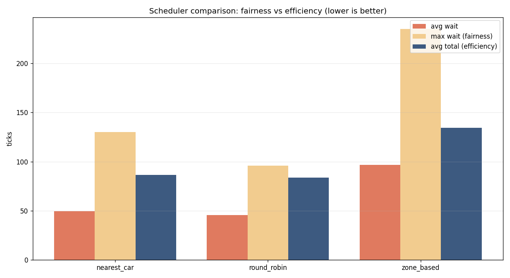
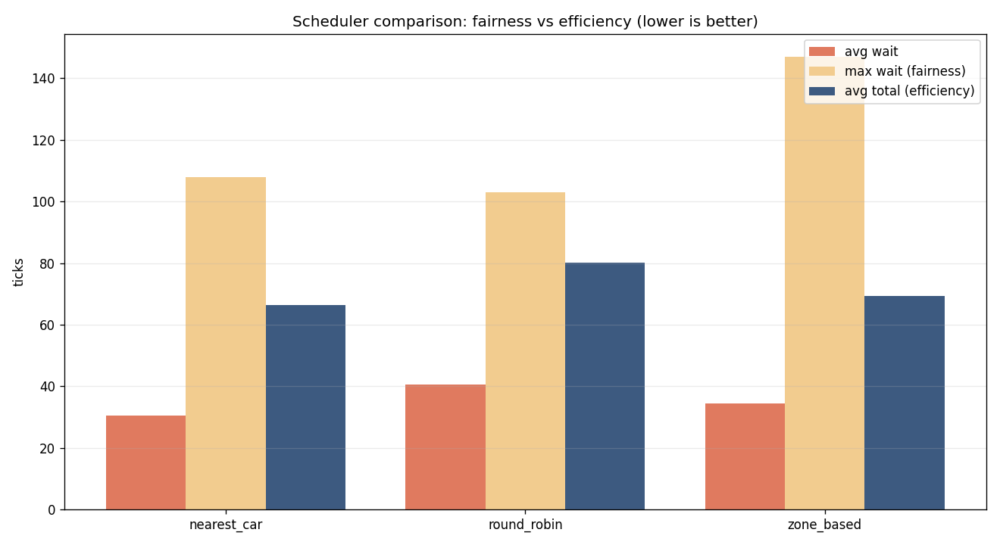

# Elevator System Simulation

A discrete-time simulation of a modern **Destination Dispatch** elevator system.
Passengers declare both their origin *and* destination at request time; the
controller immediately and permanently assigns each request to a specific
elevator, then the fleet serves everyone while minimising time per passenger.

## Objectives (from the brief)

1. **Serve all requests eventually** — no passenger waits forever.
2. **Minimise total time per passenger**, where `total_time = wait_time + travel_time`.
3. **Honor elevator constraints** — capacity and direction logic.

## How to Run

The core simulation has **no third-party dependencies** and runs on **Python
3.12+**. The project is managed with [uv](https://docs.astral.sh/uv/).

### With uv (recommended)

```bash
uv sync                                   # create .venv + install dev deps
uv run elevator-sim --requests data/requests.csv          # run
uv run elevator-sim --requests data/requests.csv --plot   # run + charts
uv run pytest -q                          # tests
```

`uv` provisions a compatible Python and the matplotlib/pytest dev dependencies
automatically. The core sim needs nothing beyond the standard library; only the
optional `--plot` charts require matplotlib.

### Without uv (stdlib only, no plots)

```bash
python main.py --requests data/requests.csv

python main.py \
    --requests data/requests.csv \
    --elevators 3 \
    --floors 51 \
    --capacity 8 \
    --strategy nearest_car \
    --output-dir output
```

CLI options:

| Flag             | Default            | Meaning                                   |
| ---------------- | ------------------ | ----------------------------------------- |
| `--requests`     | `data/requests.csv`| Input CSV (`time,id,source,dest`)         |
| `--elevators`    | `3`                | Number of elevator cars                   |
| `--floors`       | `51`               | Number of floors (1-indexed, ground = 1)  |
| `--capacity`     | `8`                | Max simultaneous passengers per car       |
| `--strategy`     | `nearest_car`      | `nearest_car`, `zone_based`, or `round_robin` |
| `--start-floor`  | `1`                | Floor every car starts on                 |
| `--num-express`  | `0`                | Make the last N cars express (needs < #elevators) |
| `--express-min-floor` | `None`        | Lowest non-lobby floor express cars serve |
| `--output-dir`   | `output`           | Where logs/summary are written            |
| `--plot`         | off                | Also write matplotlib charts              |
| `--compare`      | off                | Run every strategy and print a comparison table |

### Bonus features

```bash
# Compare every scheduling strategy on the same scenario
uv run elevator-sim --requests data/rush_hour.csv --compare --plot

# Express elevators: make 1 of 3 cars serve only the lobby + floors >= 26
uv run elevator-sim --requests data/rush_hour.csv --num-express 1 --express-min-floor 26

# Zone-based scheduling
uv run elevator-sim --requests data/rush_hour.csv --strategy zone_based
```

Two bundled scenarios drive the comparison: `data/rush_hour.csv` (a lobby rush)
and `data/inter_floor.csv` (traffic spread across floors). They **invert the
strategy ranking** — round-robin wins the rush, nearest-car wins inter-floor —
which is the core fairness-vs-efficiency finding. See
[DECISIONS.md §3.6](DECISIONS.md).

### Running the tests

```bash
uv run pytest -q
```

### Development

```bash
uv run ruff check .            # lint
uv run ruff format .           # auto-format
uv run mypy                    # static type check
uv run pytest -q               # tests + coverage (gated at 85%)
uv run bandit -c pyproject.toml -r src   # security scan (code)
uv run pip-audit               # security scan (dependencies)
uv run pre-commit install      # run the above automatically on each commit
```

Continuous integration (GitHub Actions) runs the test suite across Python
3.12–3.13 plus a lint + type-check + security job on every push.

To refresh the committed sample charts in `docs/` after changing chart code:

```bash
uv run elevator-sim --plot --output-dir output
cp output/*.png docs/
```

## Input Format

A CSV with a header row. Each subsequent row is one request:

```csv
time,id,source,dest
0,passenger1,1,51
0,passenger2,1,37
10,passenger3,20,1
```

* `time` — integer tick the request is made
* `id` — unique passenger id
* `source` — origin floor
* `dest` — destination floor

The engine only ever reads requests for the **current** tick — it never peeks
ahead in the request list.

## Outputs

Written to `--output-dir` (default `output/`, git-ignored):

* **`positions.csv`** — the required elevator position log: one row per tick,
  one column per elevator (`time, elevator_0, elevator_1, ...`).
* **`passengers.csv`** — per-passenger lifecycle (request/pickup/dropoff times
  and derived wait/travel/total times); useful for analysis and plots.
* **`summary.txt`** — the passenger summary statistics (also printed to stdout):
  min / max / average of **wait**, **travel**, and **total** time, plus
  observations (delivered count, run length, worst-case passengers).
* **`*.png`** (with `--plot`) — `elevator_paths.png` (every car's floor over
  time), `passenger_times.png` (stacked wait + travel per passenger), and
  `time_distribution.png` (wait/total histograms).

Example summary:

```
PASSENGER SUMMARY STATISTICS
========================================================
wait_time    min=   0  max=  88  avg=  31.80  (n=10)
travel_time  min=  20  max=  85  avg=  50.30  (n=10)
total_time   min=  37  max= 135  avg=  82.10  (n=10)
--------------------------------------------------------
Passengers delivered : 10 / 10
Simulation length    : 158 ticks
```

## Visualizations

Generated with `--plot` (sample run: 3 elevators, 51 floors, capacity 8,
`nearest_car`). These committed samples live in `docs/`.

**Elevator positions over time** — the morning floor-1 rush up, the peak, and
the descent to serve down-traffic:



**Per-passenger wait + travel** — the orange (wait) vs. blue (travel) split is
the fairness-vs-efficiency story; mid-rush passengers wait far longer:



**Wait & total time distributions** — note the bimodal wait distribution
(passengers a car was already approaching vs. those starved during the rush):



**Strategy comparison (fairness vs efficiency)** — every scheduler on two
scenarios that **invert the ranking**. Under a lobby rush, `round_robin`'s blind
load-spreading wins and `zone_based` is worst (all origins in one zone); under
spread inter-floor traffic, `nearest_car` and `zone_based` pull ahead because
locality finally helps. No strategy wins everywhere — full analysis in
[DECISIONS.md §3.6](DECISIONS.md):

Lobby rush:



Spread inter-floor traffic:



## Design Overview

The code is split so that *what gets decided* is separate from *how the cars
move* and *when things happen*:

| Module             | Responsibility                                              |
| ------------------ | ---------------------------------------------------------- |
| `models.py`        | `Request`, `Passenger`, `Elevator` (movement + LOOK route) |
| `scheduler.py`     | Pluggable assignment policies (which car gets a request)   |
| `simulation.py`    | The discrete-time tick loop / engine                       |
| `stats.py`         | Summary statistics + output writers                        |
| `io_utils.py`      | Request CSV loading                                        |
| `compare.py`       | Run strategies head-to-head and tabulate metrics          |
| `viz.py`           | Optional matplotlib charts (lazy import)                   |
| `cli.py`/`main.py` | CLI wiring (`elevator-sim` entrypoint + thin shim)        |

**Time model.** Discrete ticks; one tick = one floor of travel. A stop costs
one extra **dwell** tick during which passengers board/alight.

**Each tick:** release requests timestamped *now* → assign each to a car →
every car either services its floor (dwell) or moves one floor along its route →
log all positions.

**Movement.** Each car uses the **LOOK** ("elevator algorithm") scan: keep going
in the current direction serving every stop, then reverse when nothing remains
ahead. A car's stops are the destinations of its onboard passengers plus the
source floors of passengers assigned to it but not yet aboard.

**Scheduling.** The default `nearest_car` strategy assigns each request to the
car that can reach the pickup floor soonest (direction-aware), with a
load-balancing penalty so work spreads across the fleet. `zone_based` assigns by
which floor-band owns the source; `round_robin` is a naive baseline. New
strategies implement one method and register themselves — the engine never
changes.

**Express elevators.** Cars can be restricted to a subset of floors. The engine
filters the fleet to cars that can serve a request *before* the scheduler
chooses, so express constraints are honored without any scheduler changes (and a
standard car is always required, so no passenger can be stranded).

See **[DECISIONS.md](DECISIONS.md)** for the full reasoning, trade-offs, and a
walkthrough of likely follow-up questions.

## Assumptions, Simplifications & Trade-offs

A short list (full detail in DECISIONS.md):

* Floors are **1-indexed** (ground = 1); the sample data goes up to floor 51.
* **Dwell = 1 tick per stop** regardless of how many people board/alight.
* Boarding/alighting are **instantaneous within** that dwell tick.
* A passenger's car assignment is **fixed at request time** (true Destination
  Dispatch) and never reassigned, even if a better car becomes available.
* If a car arrives at a pickup while **full**, the waiting passenger stays
  assigned and is collected on a later pass — never dropped.
* The `nearest_car` cost is a cheap **estimate**, not a full route re-simulation.
* **Express** elevators use a fixed "sky-lobby" pattern (lobby + floors ≥ a
  threshold); a standard car is always required so every request is serviceable.

## Time Spent

~2 hours.

## What I'd Improve With More Time

Already implemented: zone-based + express schedulers, matplotlib visualizations,
and a strategy comparison harness. With more time:

* **Smarter dispatch**: cost based on a real route re-simulation, and optional
  re-assignment when a much closer car frees up.
* **Adaptive scheduling**: detect the traffic pattern (up-peak vs. inter-floor)
  and switch strategy accordingly — the comparison shows no single strategy wins
  everywhere.
* **Richer realism**: per-floor dwell proportional to people moved, idle-car
  "parking" heuristics, and a tunable fairness-vs-efficiency weight.
* **Express tuning**: configurable per-car serviceable-floor sets (not just the
  sky-lobby pattern) and zone-aware express placement.
